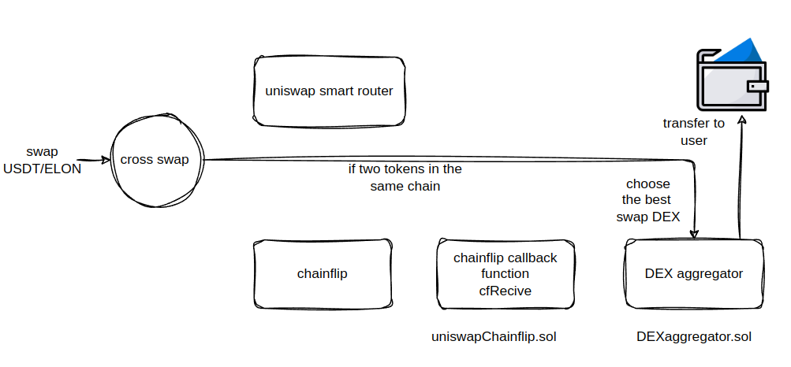

# Cross-Chain DEX Aggregator 🚀

   

This project is a Solidity-based cross-chain DEX aggregator, which combines **Uniswap** and **Chainflip** to perform token swaps across chains. It ensures users get the best swap prices and facilitates cross-chain functionality through Chainflip’s integration.

## Features ✨

- **Cross-Chain Swaps**: Swap tokens between chains using Chainflip.
- **Best Price Aggregation**: Choose the best swap rates from Uniswap and potentially other DEXes.
- **Token Support**: Handles both native and ERC20 tokens.
- **Extendable**: The architecture allows for easy integration of additional DEXes or cross-chain protocols.

## Smart Contracts 🛠️

1. **DEXAggregator.sol**: This contract aggregates different DEXes (initially supporting Uniswap) to find the best price for token swaps.
2. **UniswapChainflip.sol**: A contract that integrates Chainflip’s cross-chain functionality with Uniswap’s token swapping capabilities, supporting ERC20 and native ETH swaps.

## How It Works
<div>
  
  
</div>

## Getting Started 🛠️

### Prerequisites

- **Foundry**: A Solidity development toolchain.
- **Node.js**: For JavaScript package management and scripts.
- **Infura or Alchemy API**: For connecting to Ethereum networks.
- **Wallet**: For deploying contracts (like MetaMask or hardware wallets).

### Installation

1. **Install Foundry**:
   ```bash
   curl -L https://foundry.paradigm.xyz | bash
   foundryup
   ```

2. **Clone the repository**:
   ```bash
   git clone https://github.com/yourusername/cross-chain-dex-aggregator.git
   cd cross-chain-dex-aggregator
   ```

3. **Install dependencies**:
   ```bash
   forge install
   ```

### Project Setup

1. Open the repository in your preferred code editor.
2. Ensure that the contracts and scripts are set up as per the project structure.
3. Configure your environment variables (private key, Infura API key) by creating a `.env` file in the root folder:
   ```bash
   PRIVATE_KEY=<your_private_key>
   INFURA_API_KEY=<your_infura_key>
   ```

## Testing 🧪

The project includes Foundry-based tests to validate contract behavior.

1. **Run all tests**:
   ```bash
   forge test
   ```

### Running TEST in Verbose Mode:
You can use Foundry’s `-vv` flag for more detailed test outputs:
```bash
forge test -vv
```

## Deployment 🚀

### Using Foundry’s Solidity Scripts

1. **Prepare the deployment script**: Found in `script/Deploy.s.sol`.

2. **Deploy on a testnet (Rinkeby)**:
   ```bash
   forge script script/Deploy.s.sol --rpc-url https://rinkeby.infura.io/v3/<INFURA_PROJECT_ID> --broadcast --verify
   ```

3. **Environment Variables**: Make sure your `.env` file has the necessary details for broadcasting transactions.
   ```bash
   PRIVATE_KEY=<your_private_key>
   INFURA_API_KEY=<your_infura_key>
   ```

## Configuration ⚙️

### Foundry Configuration (`foundry.toml`)

Here’s an example `foundry.toml` file for your project configuration:

```toml
[profile.default]
src = 'src'
out = 'out'
libs = ['lib']
solc_version = '0.8.26'
optimizer = true
optimizer_runs = 200

[rpc_endpoints]
rinkeby = "https://rinkeby.infura.io/v3/YOUR_INFURA_PROJECT_ID"
```

## Troubleshooting 🛠️

- **Compilation Errors**: Ensure you’re using the correct Solidity version (`0.8.26`). Check your `foundry.toml` file.
- **Missing Libraries**: Use `forge install` to install any external dependencies.

## Contribution Guidelines 🤝

Feel free to fork this repository and submit pull requests. Contributions are welcome, especially if you're interested in extending functionality (e.g., adding more DEXes or cross-chain protocols).

## License 📄

This project is licensed under the MIT License. See the [LICENSE](LICENSE) file for more details.


